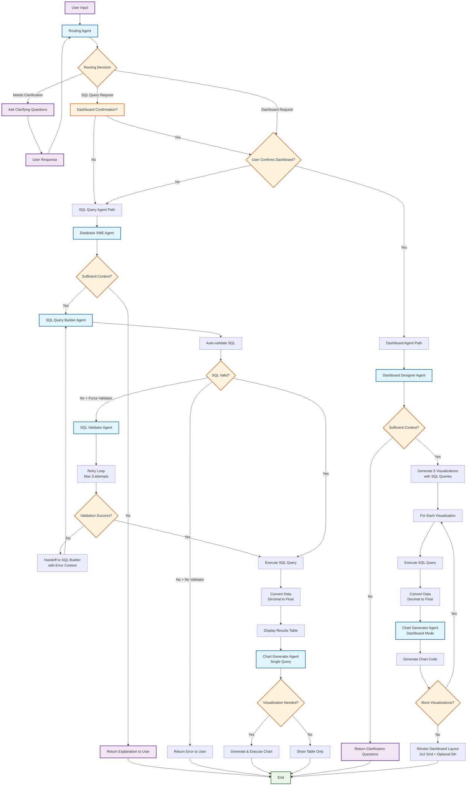

# Agent Handoff Flowchart

This flowchart shows the detailed agent handoff patterns and workflow in the SnowGPT application.

## Agent Descriptions

### Core Agents

1. **Routing Agent** - Analyzes user requests and determines the appropriate specialized agent
2. **Database SME Agent** - Analyzes database context and user requirements
3. **SQL Query Builder Agent** - Generates SQL queries from natural language
4. **SQL Validator Agent** - Validates and refines SQL queries (optional)
5. **Chart Generator Agent** - Creates visualization code for both single queries and dashboards
6. **Dashboard Designer Agent** - Creates comprehensive multi-panel dashboards

### Key Decision Points

- **Dashboard Confirmation**: Routing agent asks for explicit confirmation before dashboard creation
- **Sufficient Context**: SME and Dashboard agents check if enough information is available
- **SQL Validation**: Multiple validation paths with retry mechanisms
- **Visualization Need**: Chart agent determines if visualization is appropriate for the data

### Retry Mechanisms

- **SQL Validation Loop**: Up to 3 attempts with error context feedback
- **Context Building**: Routing agent can loop indefinitely until clear handoff

### Chart Generation Modes

- **Single Query Mode**: After SQL execution, generates one chart
- **Dashboard Mode**: Generates multiple charts for dashboard layout