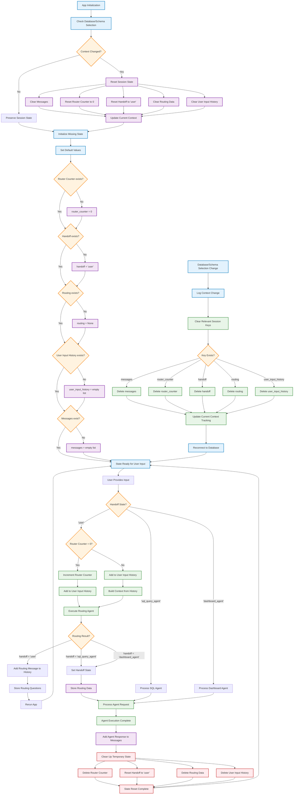

# Session State Management Flowchart

This flowchart shows the session state management and lifecycle in the SnowGPT application.

## Session State Variables

### Core State Variables

| Variable | Type | Purpose | Reset Conditions |
|----------|------|---------|------------------|
| `messages` | List | Chat history storage | Database/schema change |
| `router_counter` | Int | Routing iteration tracking | Agent completion, context change |
| `handoff` | String | Current workflow state | Agent completion |
| `routing` | Object | Routing agent output | Agent completion, context change |
| `user_input_history` | List | Multi-turn context building | Agent completion, context change |
| `current_db` | String | Database context tracking | Never (persistent) |
| `current_schema` | String | Schema context tracking | Never (persistent) |

### State Values

#### Handoff States
- `'user'` - Waiting for user input or routing
- `'sql_query_agent'` - Processing SQL query request
- `'dashboard_agent'` - Processing dashboard request

#### Router Counter Logic
- `0` - First user interaction, direct routing
- `>0` - Follow-up interaction, context accumulation

## State Lifecycle Events

### Initialization
1. Check for context changes (database/schema)
2. Reset state if context changed
3. Initialize missing state variables with defaults
4. Prepare for user input

### User Interaction Cycle
1. Capture user input
2. Route based on current handoff state
3. Process through appropriate agent
4. Update messages and state
5. Clean up temporary state
6. Reset to user state

### Context Change Handling
1. Detect database/schema selection change
2. Log context change event
3. Clear conversation-specific state
4. Update persistent context tracking
5. Reconnect to new database context
6. Resume normal operation

### State Cleanup
- **Temporary State**: Cleared after each agent completion
- **Persistent State**: Maintained across interactions unless context changes
- **Context State**: Only updated on database/schema changes